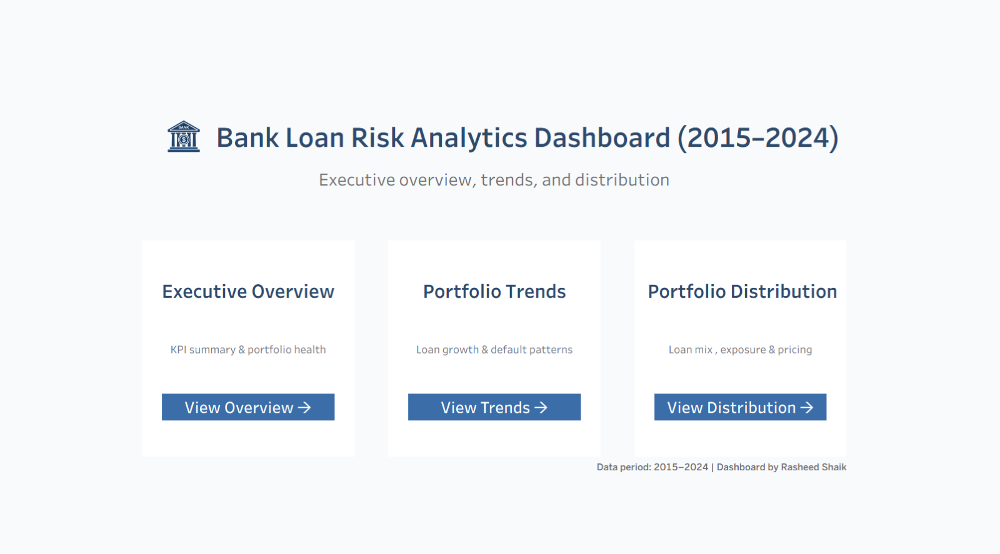
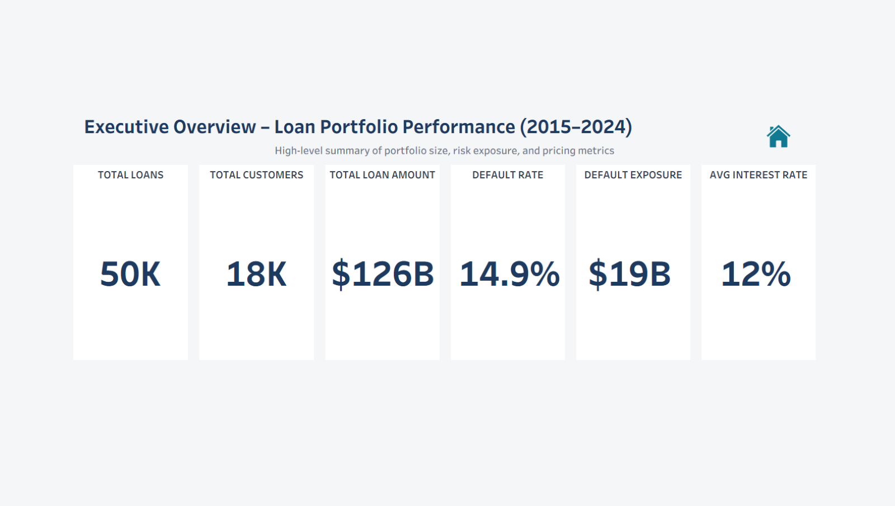
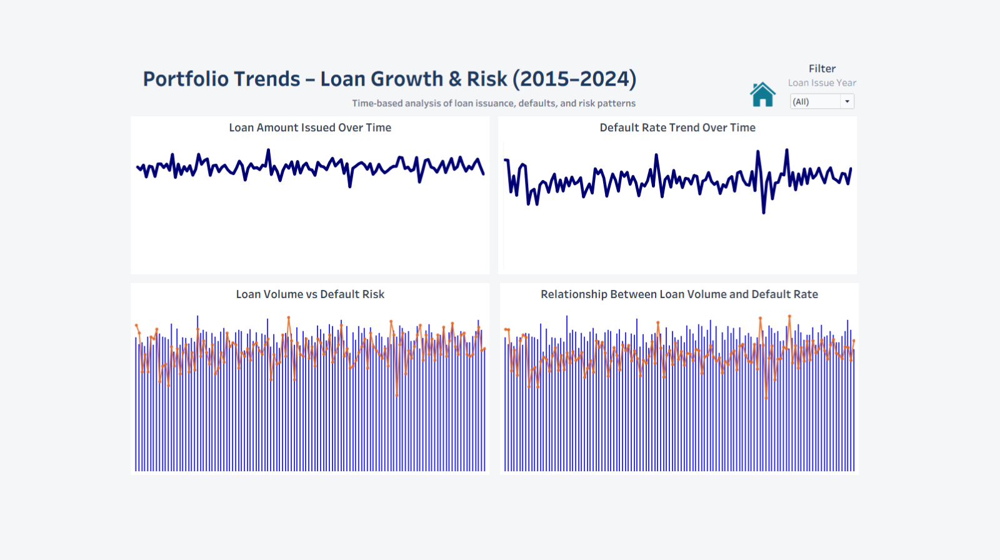
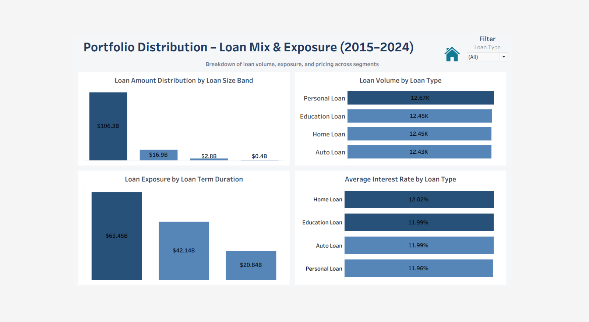

# Bank Loan Risk & Portfolio Analytics (SQL + Tableau)
## Project Overview

🔗 **Interactive Tableau Dashboard**  
👉 [View Interactive Dashboard](https://public.tableau.com/views/BankLoanRiskAnalyticsDashboard20152024/HOME?:language=en-GB&:sid=&:redirect=auth&:display_count=n&:origin=viz_share_link)

This project is an end-to-end analytics solution designed to analyze a bank’s loan portfolio and assess portfolio performance, default risk, and exposure distribution over time.

The objective is to support executive and risk-management decision-making by providing:

- High-level portfolio KPIs

- Time-based loan issuance and default trends

- Loan portfolio distribution by type, amount, and tenure

The project follows a real-world analytics workflow, using SQL for data validation, transformation, and business logic, and Tableau for interactive visualization and storytelling.

---

## Business Context

Banks manage large volumes of loans across multiple years. Understanding how loan growth, defaults, and exposure evolve over time is critical for maintaining portfolio health and controlling financial risk.

This solution enables stakeholders to:

- Monitor overall loan portfolio health

- Identify default patterns and risk exposure

- Analyze loan concentration across segments

- Support data-driven lending and risk strategies


## 📂 Repository Structure
```
bank-loan-risk-portfolio-analytics-sql-tableau/
│
├── sql/
│   ├── 01_data_quality_checks.sql        # Data validation & quality checks
│   ├── 02_data_transformation.sql        # Standardization & derived columns
│   ├── 03_business_logic.sql             # Master loan-level dataset
│   └── 04_analytical_views.sql           # KPI & analytical views
│
├── datasets/
│   └── README.md                         # Dataset description & data dictionary
│
├── tableau/
│   ├── dashboard_pre_design_layout/      # draw.io wireframes used for dashboard planning
│   ├── dashboards/                       # Final dashboard screenshots
│   └── tableau_files/                    # Tableau packaged workbook (.twbx)
│
├── docs/
│   └── insights_and_recommendations.md   # Business insights & recommendations
│
├── README.md
└── LICENSE
```


## SQL Workflow


The SQL layer is structured in logical stages:

1. **Data Quality Checks**

     - Identify NULLs, duplicates, and invalid values

     - Validate ranges and data consistency

2. **Data Transformation**

     - Standardize text fields

     - Create derived columns (age bands, income bands, loan bands)

3. **Business Logic**

     - Join customer, loan, credit, and status data

     - Produce a loan-level master dataset

4. **Analytical Views**

    - Pre-aggregated KPIs

    - Trend and distribution views optimized for Tableau

This layered approach reflects real-world enterprise analytics pipelines. It improves data reliability, reusability, and performance for downstream BI tools.


---

## Tableau Dashboard Design & Planning

Before building dashboards, layout planning and navigation flow were designed using draw.io to ensure:

 - Consistent spacing and alignment

 - Executive-friendly layout

 - Clear navigation between dashboards

The wireframes are available in:

  - **[tableau/dashbaord_pre_design_layout/](https://github.com/RASHEEDSHAIK7945/bank-loan-risk-portfolio-analytics-sql-tableau/tree/main/tableau/04_dashboard_design_pre_layout)**

---
## 📖 Dashboards Overview

The Tableau solution consists of four interconnected dashboards:

 -  **Home Navigation**

     -  Central landing page providing navigation to all dashboards.

 -  **Executive Overview**

     -  High-level KPIs including total loans, total customers, total loan amount,
default rate, defaulted exposure, and average interest rate.

 -  **Portfolio Trends**

    -  Time-based analysis of loan issuance and default behavior to identify
growth patterns and risk trends.

 -  **Portfolio Distribution**

    -  Breakdown of loan portfolio by loan type, loan amount bands,
and loan term categories to analyze exposure concentration.

Dashboard screenshots are available in:

 - **[tableau/dashboards/](https://github.com/RASHEEDSHAIK7945/bank-loan-risk-portfolio-analytics-sql-tableau/tree/main/tableau/dashboard_screenshots)**

---

## 📊 Dashboard Preview

### 🏠 Home Navigation Dashboard
Central landing page providing seamless navigation across all analytical dashboards.



---

### 📈 Executive Overview Dashboard
High-level KPIs summarizing portfolio size, risk exposure, and pricing metrics.



---

### 📉 Portfolio Trends Dashboard
Time-based analysis of loan issuance, default behavior, and risk patterns.



---

### 📊 Portfolio Distribution Dashboard
Breakdown of loan mix, exposure concentration, and interest rate distribution.



---

> 📌 For full interactivity, filters, and drill-downs, explore the live dashboard on Tableau Public:  
> 👉 [View Interactive Dashboard](https://public.tableau.com/views/BankLoanRiskAnalyticsDashboard20152024/HOME?:language=en-GB&:sid=&:redirect=auth&:display_count=n&:origin=viz_share_link)

---

## Data Sources

The project uses a relational banking dataset loaded directly into a SQL Server environment.

Core entities include:

- Customers

- Loans

- Loan Status

- Credit Profile

Processed and aggregated outputs are exported as CSV files for Tableau and
described in the dataset documentation.

---

## Insights & Recommendations

Business insights and actionable recommendations derived from the dashboards
are documented separately in:

 - **[docs/insights_and_recommendations.md](https://github.com/RASHEEDSHAIK7945/bank-loan-risk-portfolio-analytics-sql-tableau/blob/main/docs/insights_and_recommendations.md)**


This ensures the project focuses not only on visualization but also on
decision-making value.

---

## 🛠️ Tools & Technologies
- **[Datasets](https://github.com/RASHEEDSHAIK7945/bank-loan-risk-portfolio-analytics-sql-tableau/tree/main/datasets):** Access to the project dataset (csv files).
- **[SQL Server Express](https://www.microsoft.com/en-us/sql-server/sql-server-downloads):** Data validation, transformation, and analytics
- **[SQL Server Management Studio (SSMS)](https://learn.microsoft.com/en-us/sql/ssms/download-sql-server-management-studio-ssms?view=sql-server-ver16):** GUI for managing and interacting with databases.
- **[Tableau Public](https://public.tableau.com/app/profile/rasheed.shaik4381/vizzes):** Dashboard development and visualization
- **[Git & GitHub](https://github.com/):**  Version control, documentation, and project sharing.
- **[DrawIO](https://www.drawio.com/):** Design data architecture, models, flows, and diagrams.

---

## Author

Rasheed Shaik  
Aspiring Data Analyst | SQL | Tableau | Data Storytelling


## License
This project is licensed under the [MIT License](LICENSE). You are free to use, modify, and share this project with proper attribution.
